# Repaso PC1 (Basado en el examén pasado)

## CREAR PROYECTO:

Para empezar, creas el proyecto de esta manera:

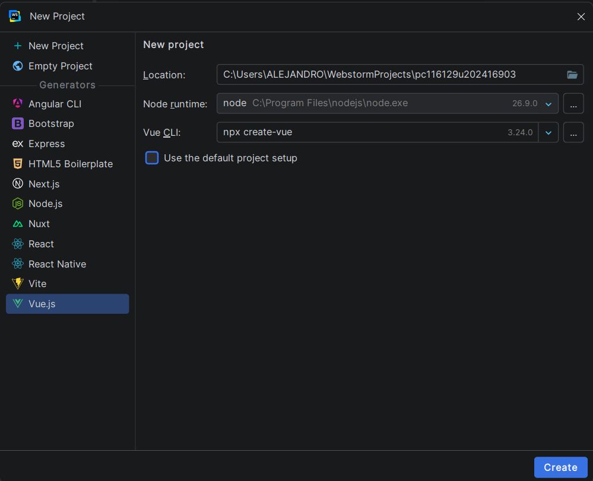

Luego, a las siguientes opciones presionas "enter" o seleccionas "No":

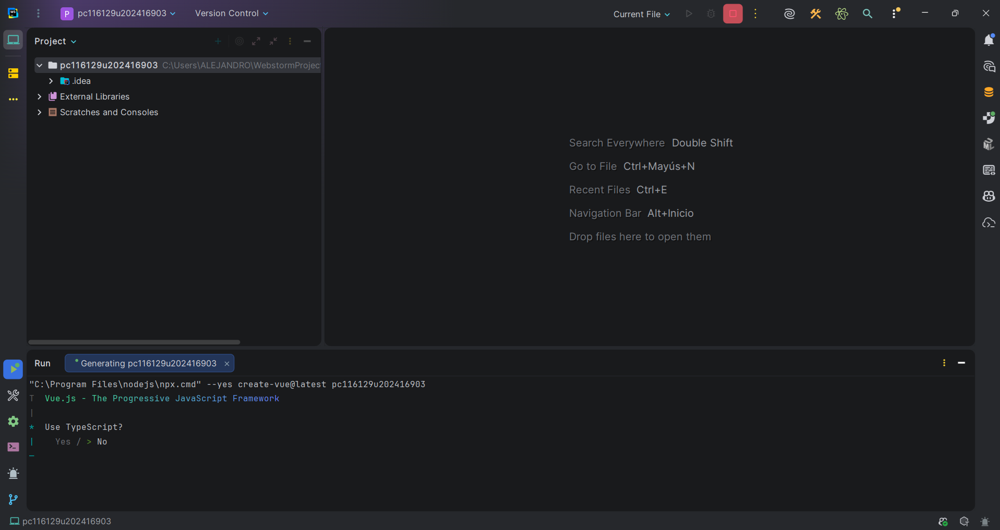

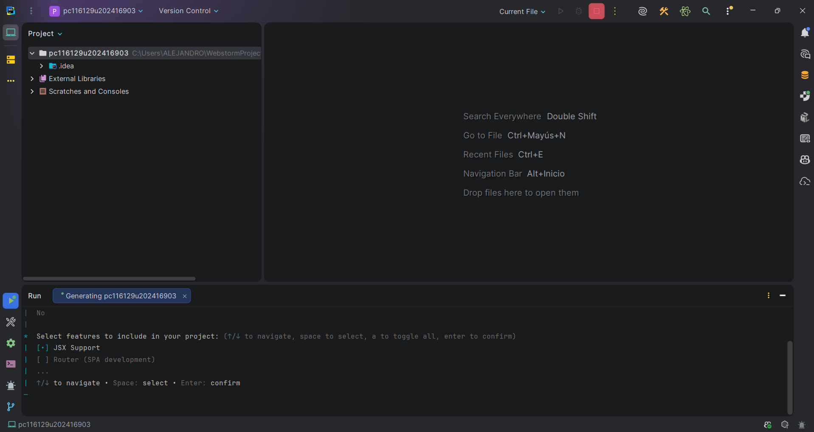

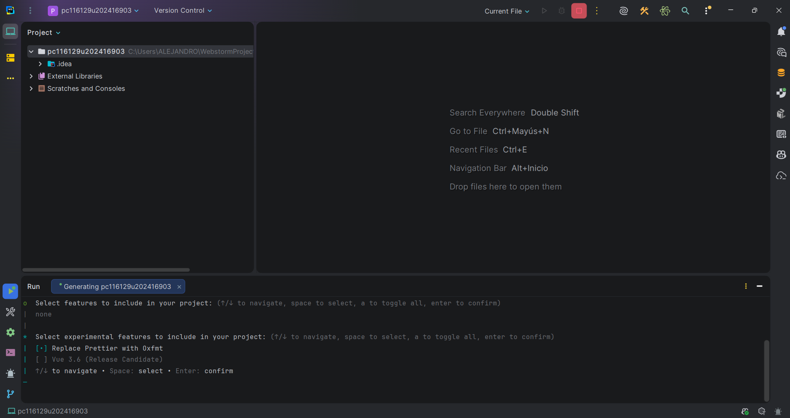

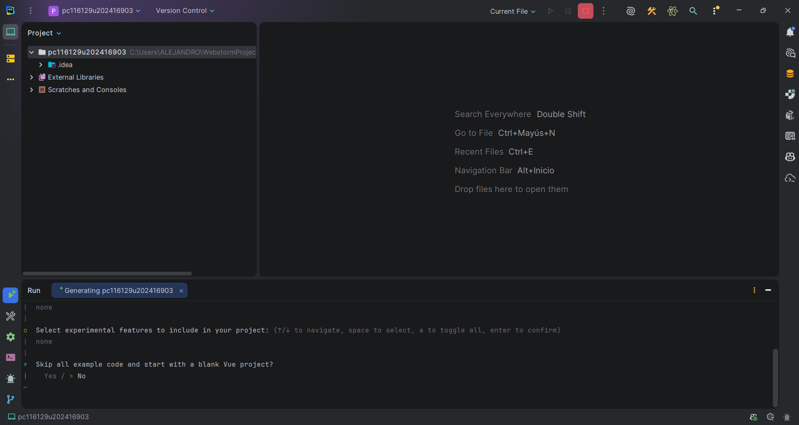

Después, por si acaso, ejecutas 'pwd':

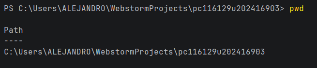

Finalmente, ejecutas 'npm install' y 'npm run dev' (Para asegurarte que el proyecto se creo bien):

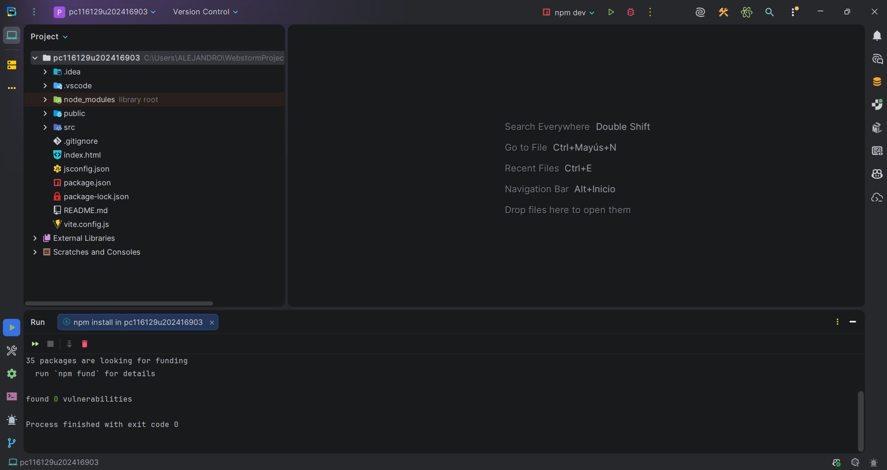

## EMPEZAR PROYECTO

Eliminas las carpetas "assets" y "components", eliminando sus referencias (Por si acaso, ejecutas 'npm run dev'):

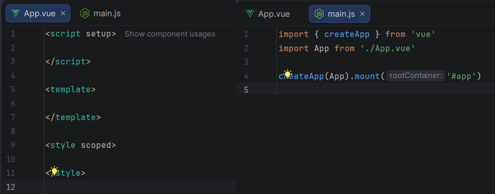

## DESARROLLAR PROYECTO

### Shared

Usar esta estructura:

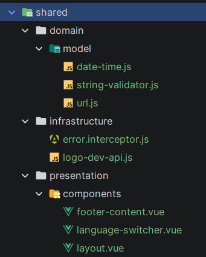

* Domain/Model: Desarollar los archivos "url.js", "string-validator" y "date-time":
* Infrastructure: Desarollar el archivo "error.interceptor.js"
* Ejecutamos estos comandos y nos aseguramos que en el archivo "package.json" esten instalados:
```sh
npm install vue-i18n
npm install axios
npm install primevue @primeuix/themes
npm install primeflex primeicons
```
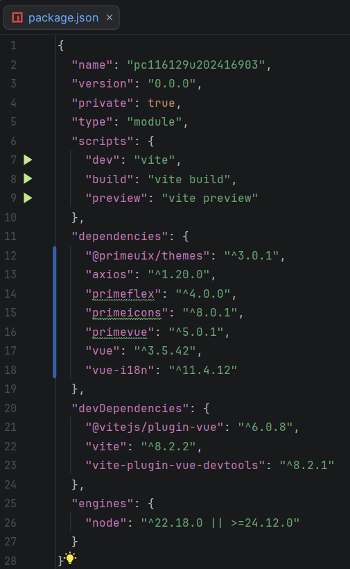

### Locales

Usar esta estructura:

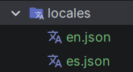

Aquí vas a crear los archivos "en.json" y "es.json, basandote en lo que se describe en el problema"

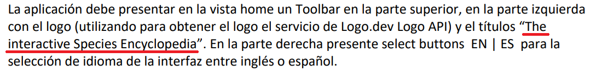

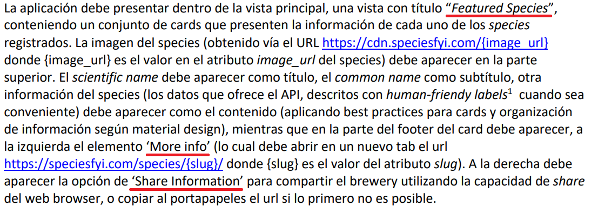

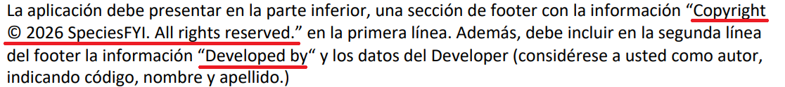

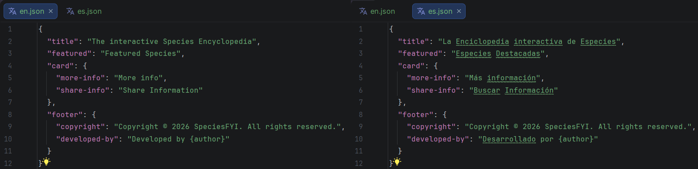

Para complementar, se crea el archivo "i18n.js", dentro de src, y también se aumenta contenido en el archivo "main.js":

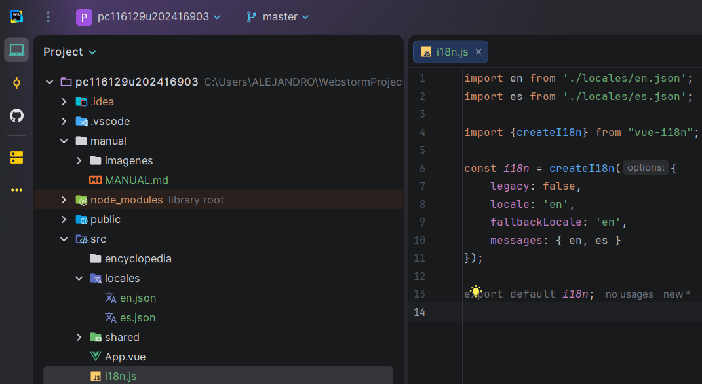
<br>
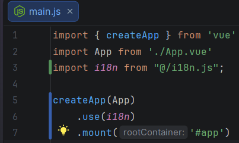

### Shared

Volviendo a shared, seguimos con la carpeta "presentation/components" y desarrollas los archivos:

* footer-content: Tienes que adaptarlo con el texto que pusiste en los archivos de "locales"
* language-switcher: Eso es copiar y pegar

### Archivos environment y Vite

Dentro del proyecto, hay que crear los archivos ".env.development" y ".env.production", que tienen el mismo contenido (El url te lo dan en el examen):

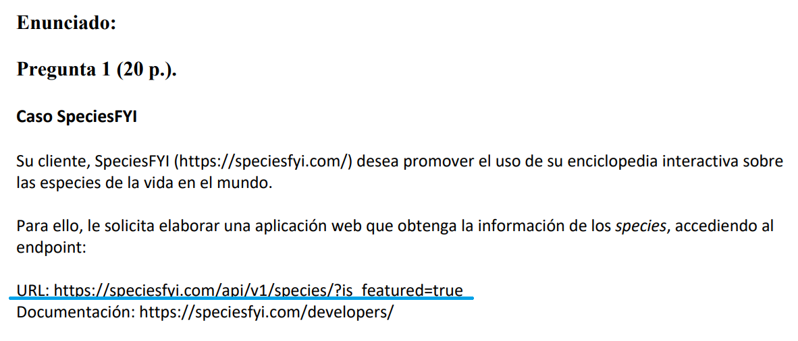
<br>
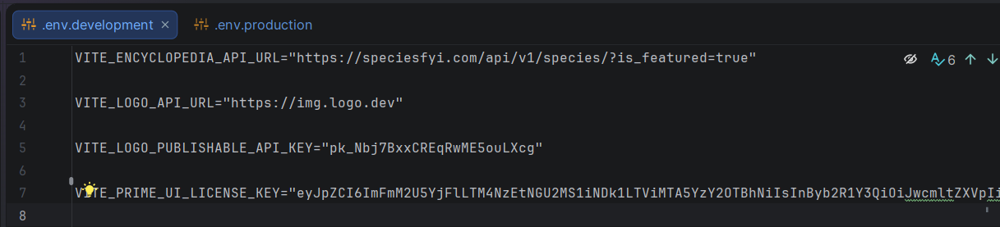

Así creas los keys:

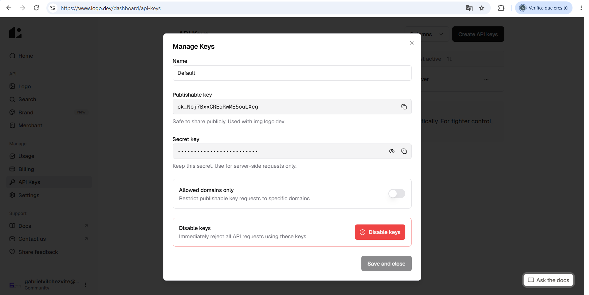

Dentro de la carpeta src, creas el archivo "vite-env.d" y lo relacionas con los environments:

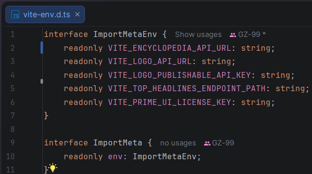

### Shared

Volviendo a un archivo que creamos antes, ose "logo-dev-api.js", lo desarrollamos para conectarlo con los environment, especificamente con lo de "VITE_LOGO_API_URL" y "VITE_LOGO_PUBLISHABLE_API_KEY" (Esto solo es copiar y pegar)


