# Repaso PC1 (Basado en el examén pasado)

Repositorio de base 1: https://github.com/GZ-99/Catch-Up-AplicacionesWeb2620/tree/master
<br>
Repositorio de base 2: https://github.com/GZ-99/Learning-Center-AplicacionesWeb2620/tree/master
<br>
Otro repaso: https://github.com/GZ-99/PC1-Repaso-AplicacionesWeb2620-2

## CREAR PROYECTO:

Para empezar, creas el proyecto de esta manera (Usa el nombre "pc116129u202416903"):


Luego, a las siguientes opciones presionas "enter" o seleccionas "No":


Después, por si acaso, ejecutas 'pwd':


Finalmente, ejecutas 'npm install' y 'npm run dev' (Para asegurarte que el proyecto se creo bien):


## EMPEZAR PROYECTO

Eliminas las carpetas "assets" y "components", eliminando sus referencias (Por si acaso, ejecutas 'npm run dev'):


## DESARROLLAR PROYECTO

### Shared

Usar esta estructura:


* Domain/Model: Desarollar los archivos "url.js", "string-validator.js" y "date-time.js":
* Infrastructure: Desarollar el archivo "error.interceptor.js"
* Ejecutamos estos comandos y nos aseguramos que en el archivo "package.json" esten instalados:
```sh
npm install vue-i18n
npm install axios
npm install primevue @primeuix/themes
npm install primeflex primeicons
```


### Locales

Usar esta estructura:


Aquí vas a crear los archivos "en.json" y "es.json, basandote en lo que se describe en el problema"


Para complementar, se crea el archivo "i18n.js", dentro de src, y también se aumenta contenido en el archivo "main.js":


### Archivos environment y Vite

Dentro del proyecto, hay que crear los archivos ".env.development" y ".env.production", que tienen el mismo contenido (El url te lo dan en el examen):


Así creas los keys:


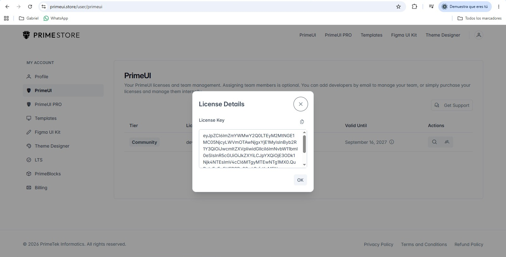

Dentro de la carpeta src, creas el archivo "vite-env.d" y lo relacionas con los environments:


### Shared

Volviendo a shared, seguimos con la carpeta "presentation/components" y desarrollas los archivos:

* footer-content: Tienes que adaptarlo con el texto que pusiste en los archivos de "locales"
* language-switcher: Eso es copiar y pegar (Para que funcione, tienes que volver a modificar el archivo "main.js" y luego creas el archivo "style.css")

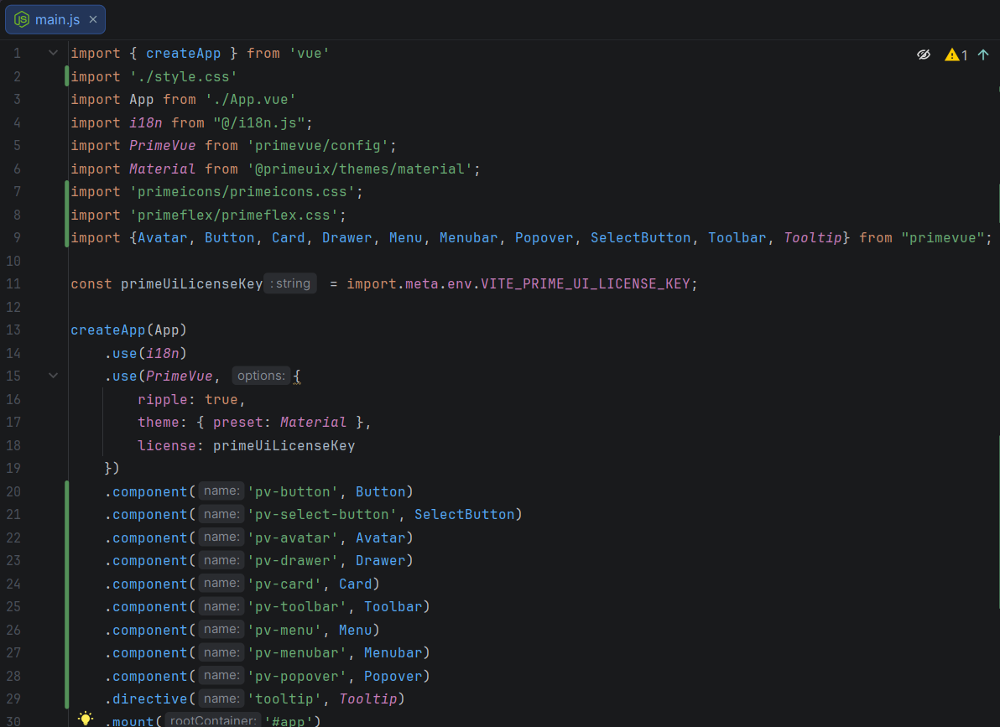

### Shared

Volviendo a un archivo que creamos antes, ose "logo-dev-api.js", lo desarrollamos para conectarlo con los environment, especificamente con lo de "VITE_LOGO_API_URL" y "VITE_LOGO_PUBLISHABLE_API_KEY", y con respecto a lo de "LogoDevApi", lo sacas del examen y de Logo.dev

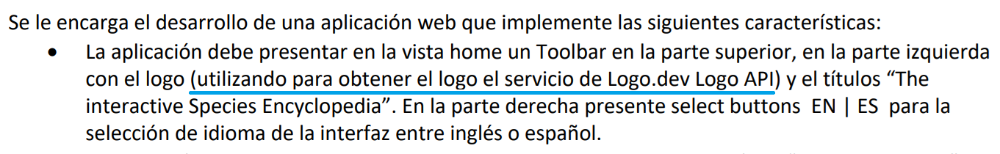


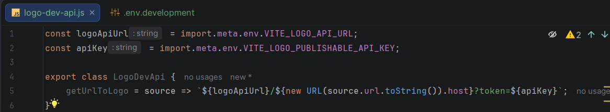

### Encyclopedia

Antes de empezar, tienes que pegar la url en está página: https://app.quicktype.io/

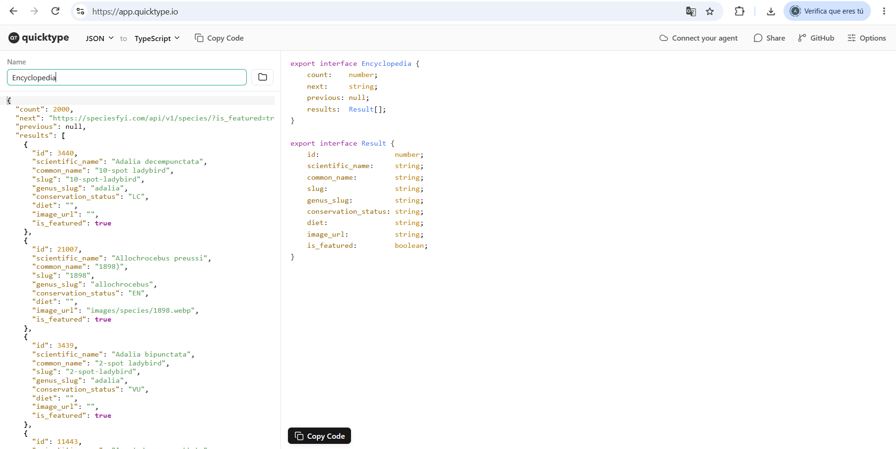

Al empezar, tienes que crear esta carpeta con esta estructura:

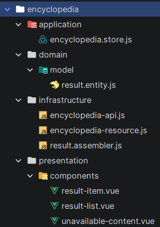

Luego, desarrollas estos archivos:
* Empiezas con el archivo entity, con su constructor y, por si acaso, sus getters.
* Desarrollas los archivos "encyclopedia-api.js" y "result.assembler.js" (El archivo "encyclopedia-resource.js" se queda vacio, no preguntes)
* Se debe desarrollar el archivo "encyclopedia.store.js"

Finalmente, en la carpeta "presentation/components", desarrollas los archivos de esta forma:
* En el archivo "unavailable-content.vue", haces un copia y pega y cambias solo un texto:<br>
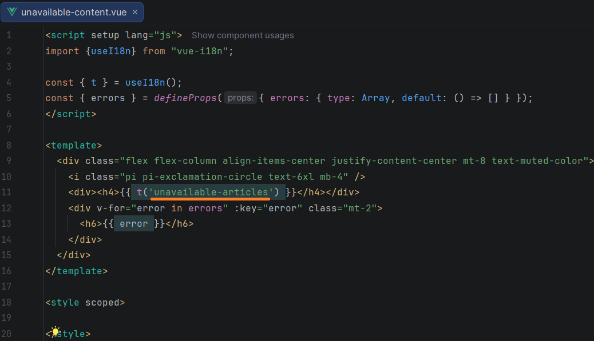
* Después, en el archivo "result-item.js" se desarrolla de esta forma:<br>
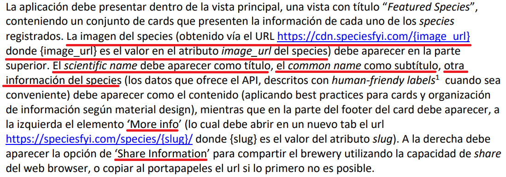
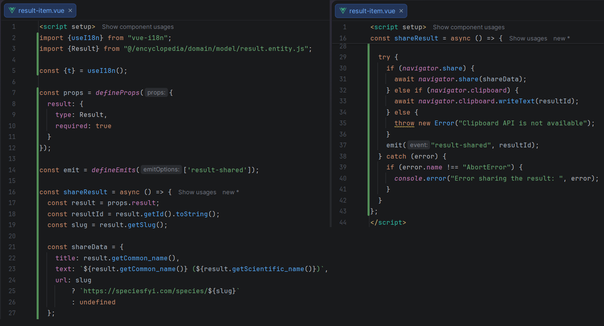
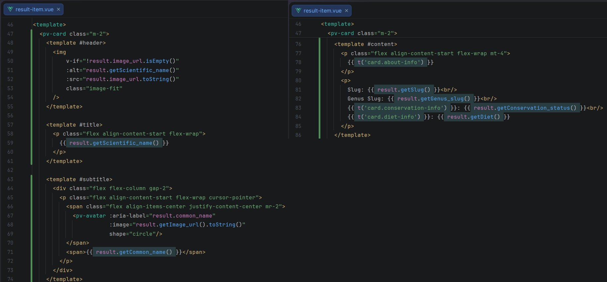
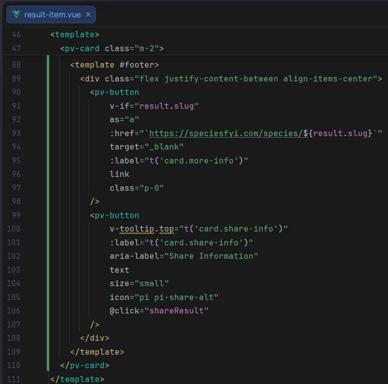
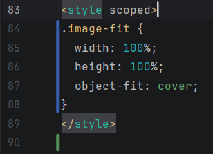
* Finalmente, se desarrolla el archivo "result-list.vue", haces un copia y pega y cambias algunos textos:<br>
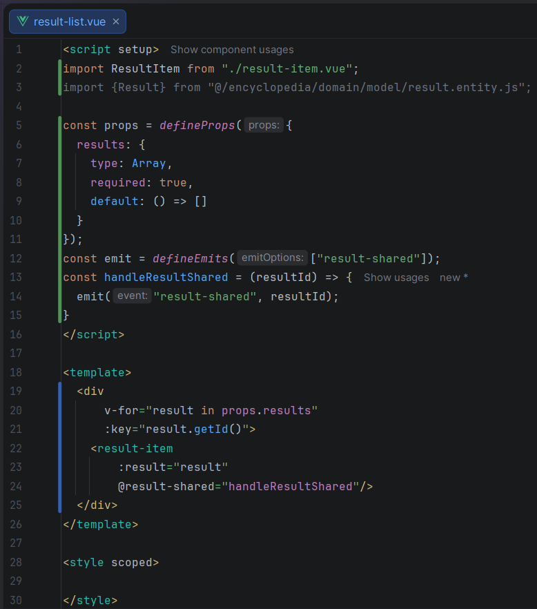

### Universities (BC Alternativo)

En caso de que te pidan cosas como esto:

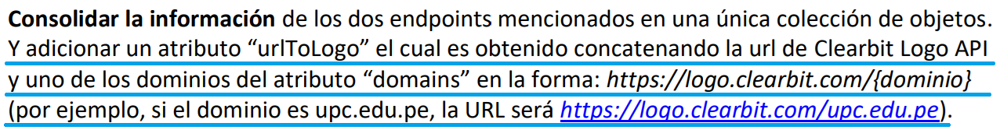

Y tienes atributos como estos:

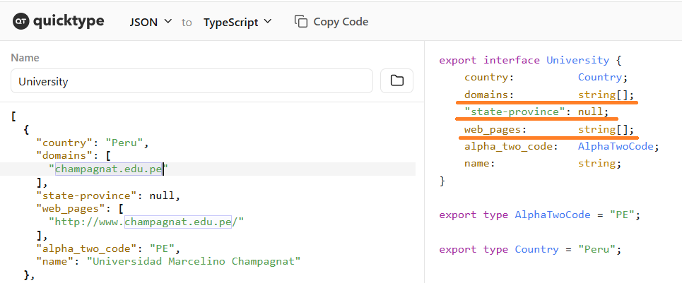

Entonces, haz algo como esto:

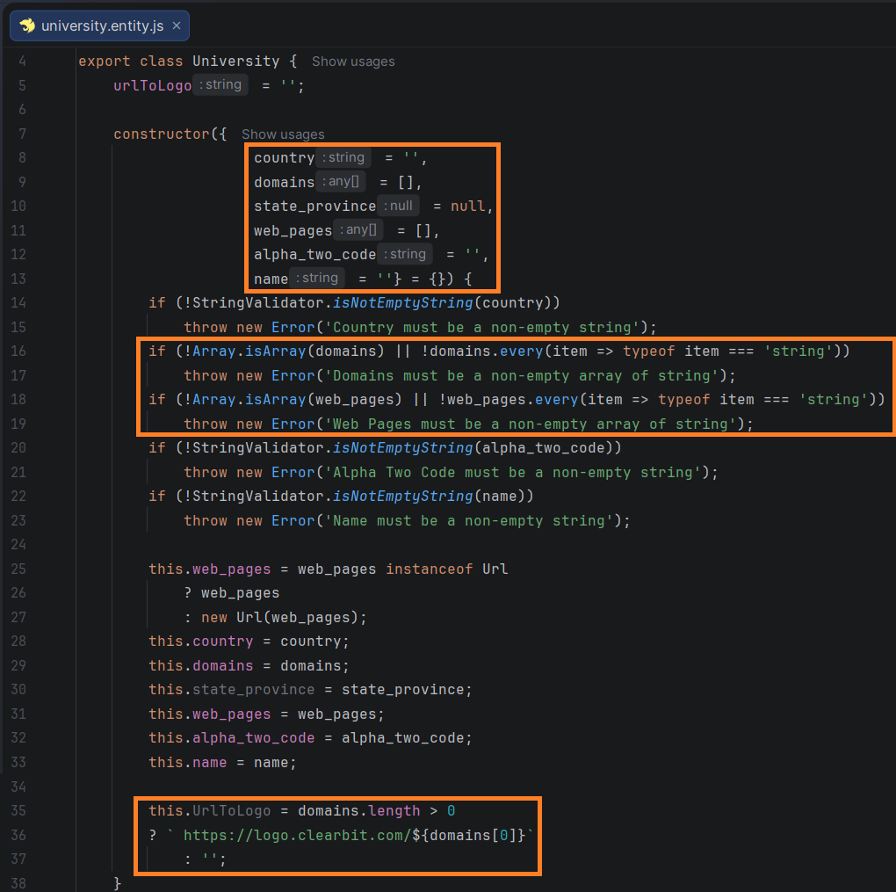

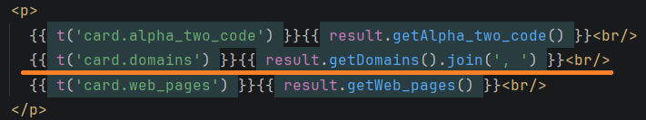

## TERMINAR PROYECTO

### Shared

Desarrollas el archivo "layout.vue", donde vas a conectar todo lo que haz hecho

### Archivo "App.vue"

Finalmente, en este archivo, copias y pegas esto:

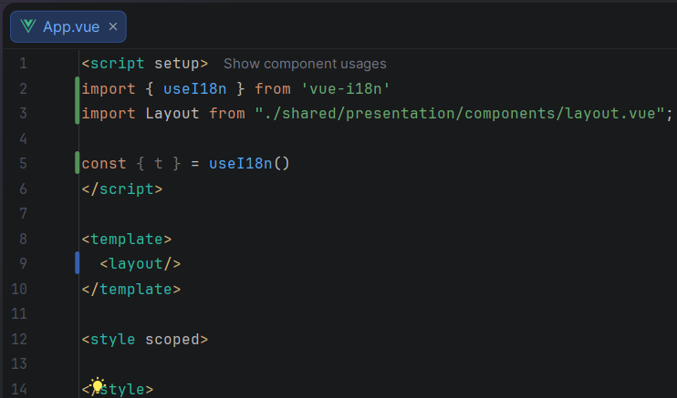

### Opcional:

Si te alcanza tiempo, cambias esto que esta en el archivo "index.html" por el nombre de la página del caso:

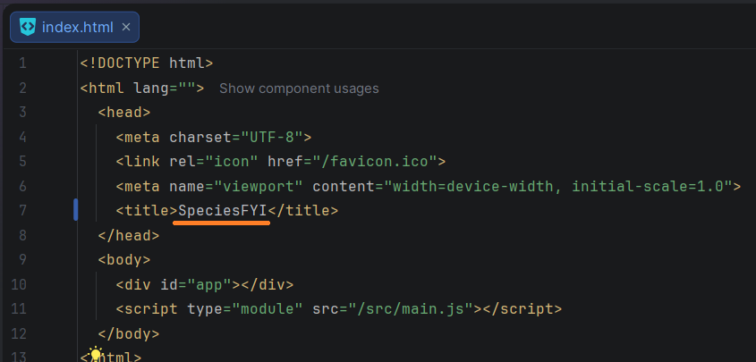

## RESULTADO FINAL

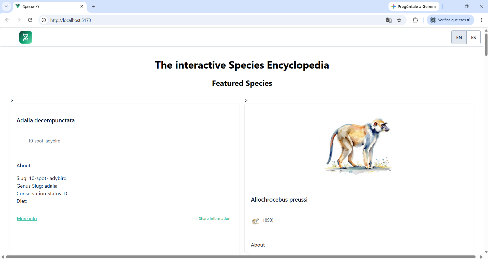

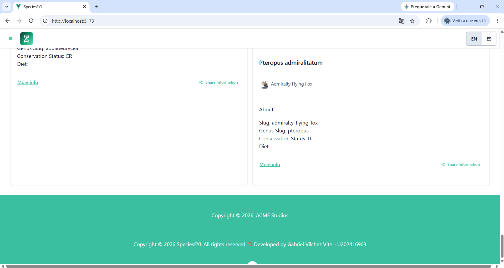
